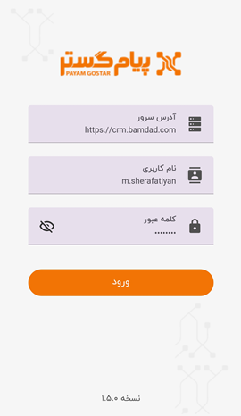

# راه های ورود به برنامه

 ممکن است بنا به دلایلی چون مرخصی رفتن، دورکاری، ماموریت، حضور در جلسه، ملاقات حضوری با مشتری و... از میز کار و سیستم‌تان دور باشید و دقیقا در همان لحظه نیاز به اطلاعات ثبت شده در نرم‌افزار پیدا کنید؛ بهترین راه‌کار در این شرایط استفاده از اپلیکیشن پیام‌گستر برای دسترسی به داده‌های سیستم به‌خاطر انجام کار و وظیفه‌تان در اولین فرصت است. استفاده از اپ پیام گستر باعث می‌شود که شما مدیران و کارمندان در هر زمان و مکانی به داده‌ها و اطلاعات به‌روز و موردنیاز خود دسترسی داشته باشید و بتوانید فایل‌های مدنظر را با سایر همکاران به اشتراک بگذارید. 
> نکته 
 اپلیکیشن پیام گستر بر روی گوشی‌های موبایل با سیستم عامل **اندروید** قابل استفاده بوده و اگر سیستم عامل گوشی‌یتان **IOS** است، باید از نسخه‌ی وب اپلیکیشن (PWA) استفاده کنید. 

پس از نصب **اپلیکیشن پیام گستر**، با نام کاربری و پسوردتان وارد نرم‌افزار شوید؛ در این مرحله در فیلد *آدرس سرور* باید IP مجموعه‌ موردنظر را بنویسید. می‌توانید IP مجموعه‌تان را از لینک (URL) نسخه تحت وب‌ بردارید، به‌طور مثال https://crm.bamdad.com می‌تواند آدرس سرور مجموعه شما باشد.

   

 برای اینکه هربار مجبور به وارد کردن آدرس سرور، نام کاربری و کلمه عبور نباشید و بدون معطلی وارد برنامه شوید، می‌توانید از اسکن اثر انگشت برای ورود استفاده کنید. برای این منظور می‌بایست پس از ورود به نرم‌افزار، از منوی  پایین صفحه، وارد  **تنظیمات** (Settings) شده و گزینه‌ی اثرانگشت را فعال  نمایید. پس از روشن کردن گزینه‌ی **اثر انگشت**، اپلیکیشن اثر انگشت ثبت شده شما در حافظه‌ی گوشی موبایل‌تان را برای ورود به نرم‌افزار ذخیره می‌کند و بعد از آن برای ورودهای بعدی، علاوه بر امکان ورود با نام کاربری، می‌توانید با اسکن اثر انگشت‌تان سریع به برنامه وارد شوید. 
 پس از انجام این پروسه، برای Refresh شدن برنامه، یک‌بار از آن خارج شده و مجدد وارد شوید.

