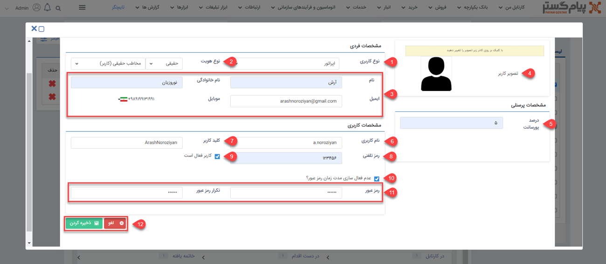

# ایجاد کاربر جدید 

برای ساخت کاربر جدید از منوی سه‌خط (همبرگری) که در سمت چپ نوار بالایی نرم‌افزار قرار گرفته، مسیر **تنظیمات** > **مدیریت گروه‌ها و کاربران** > **کاربران** > **کاربر جدید** را طی کرده و پس از باز شدن پنجره زیر، شروع به پر کردن فیلدهای آن  کنید.

### 1. نوع کاربری:
شما باید مشخص کنید که کاربرتان کدام یک از سه نوع زیر است: 
**اپراتور:**  کاربر عادی نرم افزار یا همان کارمند شرکت شما بوده که می‌بایست با توجه به چارت کاری‌اش با نرم‌افزار کار کند.  
**نماینده:**  یک نوع کاربر یا هویت بوده که نقش نمایندگی شرکت و مجموعه شما را برای مشتریان ایفا می‌کند مثلا نمایندگی شرکت شما در شهر شیراز از این دسته کاربر، به‌شمار می‌آید. 
**مشتری:**  کاربری است که مشتری و خریدار محصولات یا خدمات شرکت شما بوده و با توجه به سطح دسترسی‌ای که برایش تعیین کرده‌اید می‌تواند به [ پنل باشگاه مشتریان](https://github.com/1stco/PayamGostarDocs/blob/master/help2.5.4/Supplementary-modules/customer-club/Customer-dashboard/Customer-dashboard.md) دسترسی داشته باشد. (توجه کنید که این نوع از کاربران جزء کاربران فعال شما محسوب نمی‌شوند.) 
### 2. نوع هویت:
 شما در این فیلد می‌بایست مشخص کنید که هویت این کاربرتان حقیقی (فرد)  و یا حقوقی (شرکت) است. 
### 3. اطلاعات کاربر:
 در این فیلد مشخصات فردی کاربرتان مثل نام و نام‌خانوادگی (در صورتی که در قسمت دوم، هویت‌تان را حقوقی انتخاب کرده باشید به‌جای نام و نام‌خانوادگی، نام شرکت) و اطلاعات تماسی چون آدرس ایمیل و شماره موبایل را می‌بایست وارد کنید. توجه داشته باشید از آن‌جا که نرم افزار برای ارسال پیام‌های مختلف (از جمله پیام‌های داخل فرآیند، یا زمانی که یک وظیفه یا درخواست تایید می‌شود) نیاز به اطلاعات تماسی کاربر دارد، بنابراین لازم است این اطلاعات را دقیق و صحیح وارد کنید. 
### 4. تصویر کاربر:
 شما می‌توانید با کلیک بر روی کادر تصویر فرضی، عکس مدنظر برای کاربرتان را انتخاب و بارگذاری کنید؛ همچنین هر کاربر می‌تواند در قسمت **پروفایل من**، تصویر کاربری خود را عوض کند. 
### 5. درصد پورسانت:
 اگر می‌خواهید برای کاربر پورسانتی از فروش‌هایی که انجام می‌دهد (فاکتورها و قراردادهایی که در نرم‌افزار با نام او ثبت می‌شوند) اختصاص دهید، باید میزان درصد پورسانت را در این فیلد وارد کنید. 
### 6. نام کاربری:
 شما می‌بایست یک عنوان برای حساب کاربر خود انتخاب نمایید. در نرم‌افزار هنگام انجام عملیات‌های مختلف، به‌جای نشان‌دادن نام و نام‌خانوادگی هویت، نام کاربری‌ برای سایر افراد نمایش داده می‌شود. باید توجه داشته باشید که در تعیین نام کاربری، استفاده از حروف و اعداد فارسی امکان‌پذیر نبوده و شما فقط می‌توانید از حروف و اعداد انگلیسی و نشان‌های نگارشی چون نقطه، کاما، اسلش و آندرلاین استفاده کنید؛ همچنین نام کاربری می‌بایست بیشتر از پنج کاراکتر باشد. باید این نکته را در نظر داشته باشید که پس از ایجاد کاربر، به‌هیچ‌وجه، امکان تغییر نام کاربری وجود نخواهد داشت. 
### 7. کلید کاربر:
 برای مباحث ارتباط از طریق وب سرویس، برنامه‌نویسان از این فیلد استفاده می‌کنند و کاربرد خاصی برای کاربران عادی ندارد. در پر کردن فیلد کلید کاربر می‌بایست این نکته را در نظر داشته باشید که نوشتن حروف و اعداد فارسی و همچنین استفاده از فاصله در بین کاراکترها ممنوع بوده و باید  از حروف و اعداد انگلیسی استفاده کنید. 
### 8. رمز تلفنی:
 شما می‌توانید از فیلد *رمز عبور سیستم تلفنی*  برای اختصاص رمز تلفنی به حساب کاربران خود استفاده کنید تا هنگامی که مشتریان با سیستم تلفن گویا مجموعه شما تماس می‌گیرند با ثبت آن ارتباط‌شان برقرار شود.  
### 9. کاربر فعال است:
شما با زدن این تیک فعال بودن حساب کاربری کاربرتان را مشخص کرده و می‌توانید پس از ذخیره کردن و ایجاد کاربر، آن را در لیست کاربران مجموعه خود، مشاهده کنید.
همچنین اگر کاربری چه به‌صورت دائم و چه به‌صورت موقت با مجموعه شما قطع همکاری کرد و یا به‌خاطر عوض شدن چارت کاری‌اش نیازی به استفاده از نرم‌افزار نداشت، می‌توانید با برداشتن تیک این چک‌باکس، حساب کاربری‌اش را از حالت فعال خارج کرده تا دیگر در تعداد کاربران فعال مجموعه شما حساب نشود.
  همان‌طور که می‌دانید برای تعداد کاربران یک محدوده و بازه‌ی تعدادی دارید و این‌گونه با غیرفعال کردن کاربران اضافی، امکان ایجاد کاربر فعال جدید را برای مجموعه‌تان فراهم می‌کنید. 
> **نکته‌** 
 درصورتی‌که حساب کاربری از این بخش فعال شود و کاربر ایجاد گردد، حتی در صورت تعریف قالب پیام برای فعال‌سازی سیستم، کاربر پیام فعال‌سازی را دریافت نمی‌کند چون در این بخش شما به‌صورت دستی آن را فعال کرده‌اید. 
 ### 10. عدم فعال‌سازی مدت زمان عبور:
   شما با فعال کردن این گزینه، مشخص می‌کنید که رمز عبور این کاربر در نرم افزار، هیچ زمانی منقضی نشود و تاریخ انقضایی برایش درنظر نمی‌گیرید.
 برای تنظیم مقدار پیش‌فرض زمان منقضی شدن رمز عبور، به قسمت [تنظیمات رمز عبور حساب کاربران ](https://github.com/1stco/PayamGostarDocs/blob/master/help%202.5.4/Settings/General-settings/security/security.md)مراجعه کنید. 
 ### 11. رمز عبور:
  در این فیلد، رمز عبور کاربرتان را می‌توانید مشخص نمایید. (تعداد حروف رمز عبور، امکان منقضی شدن رمز عبور و الزام رمز پیچیده بودن آن را در قسمت [تنظیمات رمز عبور حساب کاربران ](https://github.com/1stco/PayamGostarDocs/blob/master/help%202.5.4/Settings/General-settings/security/security.md)می‌توانید تنظیم کنید.) 
 در صورت فعال‌سازی الزام رمز عبور پیچیده از تنظیمات بخش امنیتی، رمز عبور می‌بایست شامل حداقل یک حرف بزرگ، یک حرف کوچک و یک عدد باشد. 
### 12. لغو و ذخیره کردن:
 شما با استفاده از  گزینه‌‌ی *لغو* می‌توانید از ثبت کاربر انصراف دهید و یا با *ذخیره کردن* آن، کاربر را ایجاد کرده و اطلاعات وارد شده را ثبت نمایید. 
> **نکته‌** 
 لازم به ذکر است که با ایجاد کاربر، هویتی مرتبط با آن کاربر در بانک اطلاعاتی ساخته می‌شود که مسیر ذخیره آن از طریق **تنظیمات** > **تنظیمات کلی** > **دسته‌بندی کاربران** > [گروه پیش فرض ذخیره کاربران ](https://github.com/1stco/PayamGostarDocs/blob/master/help%202.5.4/Settings/General-settings/User-category/User-category.md)مشخص می‌گردد.  
 